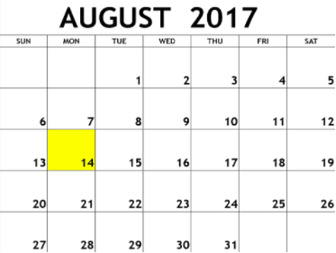

# Java Date and Time

The [Calendar class](https://docs.oracle.com/javase/7/docs/api/java/util/Calendar.html) is an abstract class that provides methods for converting between a specific instant in time and a set of calendar fields such as YEAR, MONTH, DAY_OF_MONTH, HOUR, and so on, and for manipulating the calendar fields, such as getting the date of the next week.

---

You are given a date. You just need to write the method, _getDay_, which returns the day on that date. To simplify your task, we have provided a portion of the code in the editor.

## Example
_month = 8_

_day = 14_

_year = 2017_

The method should return _MONDAY_ as the day on that date.



## Function Description

Complete the findDay function in the editor below.

findDay has the following parameters:

- int: month 
- int: day 
- int: year

## Returns

- string: the day of the week in capital letters

## Input Format

A single line of input containing the space separated month, day and year, respectively, in _MMDDYYYY_ format.

## Constraints

- _2000 < year < 3000_

## Sample Input

```
08 05 2015
```

## Sample Output

```
WEDNESDAY
```

## Explanation

The day on August _5<sup>th</sup> 2015_ was _WEDNESDAY_.

